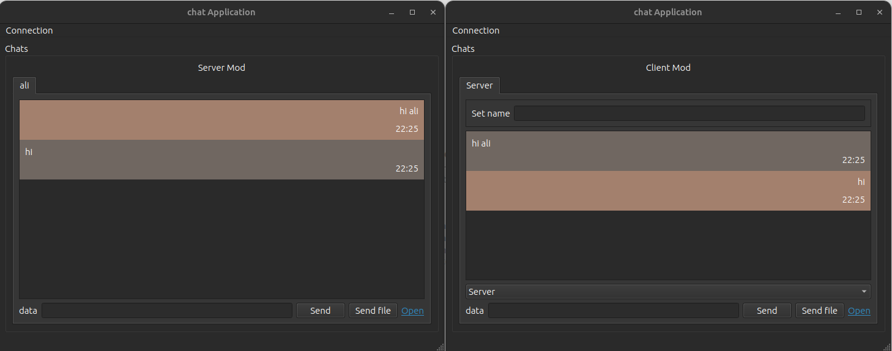

# Chat-application

- A chat application developed with Qt Widgets and C++.
- the project is configured with the build system using qmake.

## Features

- Multi-client support for connecting to a server.
- Smooth chat experience between the server and clients, as well as among clients.
- Real-time indication of typing status for each participant.
- Effortless file transfer between the server and clients, accommodating files up to 85 kilobytes.

## Building

```
cd build
qmake ..
make
./TcpServer

```
## Demo


