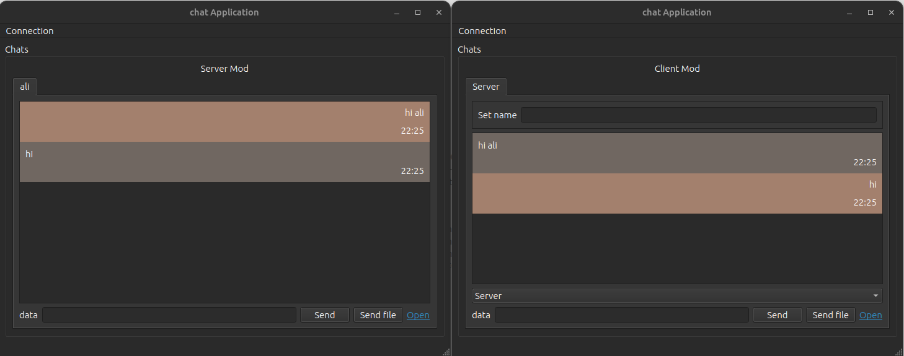

# Chat Application

A simple LAN chat application built with **Qt Widgets** and **C++**, using **qmake** as the build system. The app can run in either **server** or **client** mode from the same executable.

## Features

- 🖥️ Run as a server or connect as a client, from the same app
- 👥 Multiple clients can connect to the server simultaneously
- 💬 Chat with the server or with any connected client
- ⌨️ Real-time typing indicator
- ✏️ Change your display name on the fly (with duplicate-name rejection)
- 📁 File transfer between server and clients

## Demo



## Building

This project uses **qmake**. Open `TcpServer.pro` in Qt Creator, select a kit, and build — or from the command line:

```bash
qmake
make
```

## Usage

1. Launch the app on one machine and choose **Server Mode**.
2. Launch the app on one or more other machines (or the same machine) and choose **Client Mode**.
3. Clients connect automatically to the server on port `6000`.

## Tech Stack

- C++
- Qt Widgets
- Qt Network (`QTcpServer` / `QTcpSocket`)
