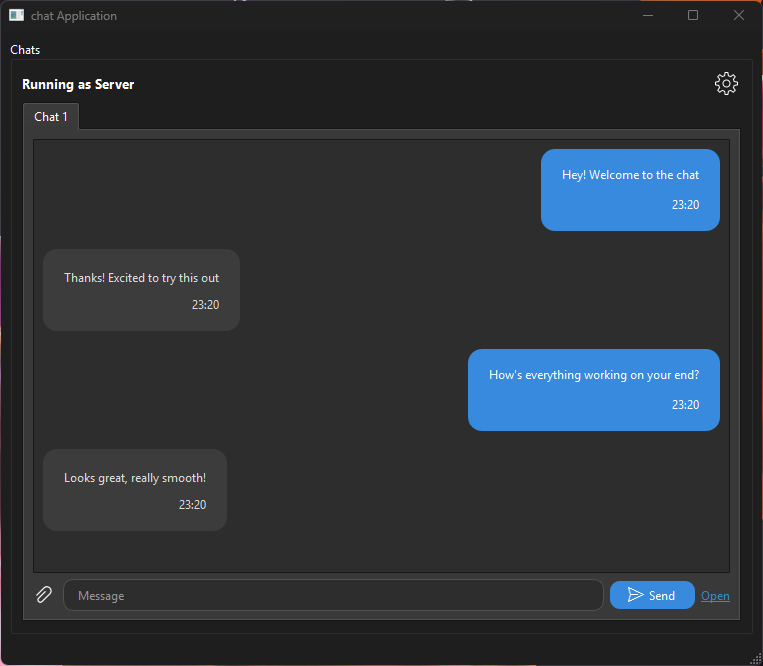
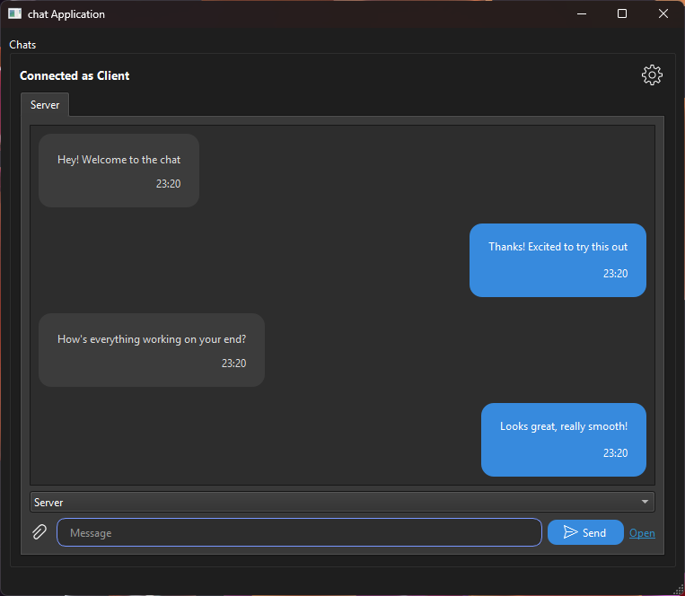

# Chat Application

A simple LAN chat app built with **Qt Widgets** and **C++** (qmake). Runs as either a server or a client from the same executable.

## Features

- Server or client mode, same app
- Multiple clients at once
- Chat bubbles, real-time typing indicator
- Change display name on the fly
- File transfer
- Consistent dark theme

## Demo

 

## Usage

1. Choose **Server Mode** on one machine (via the settings icon).
2. Choose **Client Mode** on another — it connects automatically on port `6000`.

## Tech Stack

C++17 · Qt Widgets · Qt Network
